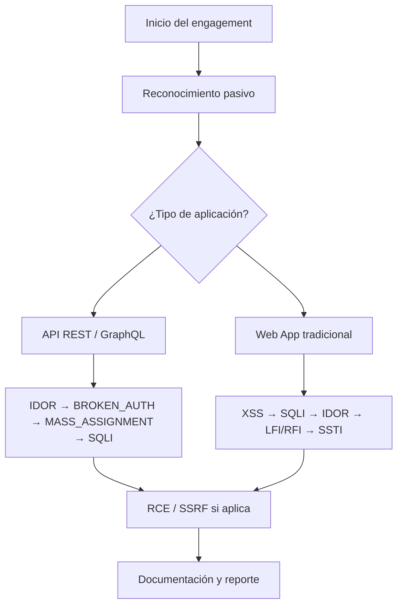

# 📚 Biblioteca de Estándares de Pentesting Web — LokiTrace Tools

> **Clasificación:** Uso interno — LokiTrace Security Team  
> **Última actualización:** 2026-05-18  
> **Metodología base:** OWASP WSTG v4.2 + PTES

---

## 🎯 Propósito

Esta biblioteca contiene estándares operativos de pentesting web. Cada estándar define un proceso repetible, estructurado y documentable para identificar, confirmar y reportar una categoría específica de vulnerabilidad.

**Principios:**
- Cada estándar cubre: reconocimiento → prueba → explotación (PoC) → documentación
- Incluye checklists de ejecución para garantizar cobertura completa
- Compatible con el flujo de trabajo del VAA API Scanner

---

## 📂 Catálogo de Estándares

### ✅ Disponibles

| # | Archivo | Vulnerabilidad | OWASP | Severidad típica |
|---|---------|---------------|-------|-----------------|
| 1 | [ESTANDAR_IDOR.md](./ESTANDAR_IDOR.md) | Insecure Direct Object Reference | A01:2021 | 🔴 Alto/Crítico |
| 2 | [ESTANDAR_BROKEN_AUTH.md](./ESTANDAR_BROKEN_AUTH.md) | Broken Authentication & Session Management | A07:2021 | 🔴 Crítico |
| 3 | [ESTANDAR_XSS.md](./ESTANDAR_XSS.md) | Cross-Site Scripting (Reflected, Stored, DOM) | A03:2021 | 🔴 Alto/Crítico |
| 4 | [ESTANDAR_SQLI.md](./ESTANDAR_SQLI.md) | SQL Injection (Error, UNION, Blind) | A03:2021 | 🔴 Crítico |

### 🔜 En desarrollo

| # | Archivo | Vulnerabilidad | OWASP |
|---|---------|---------------|-------|
| 5 | `ESTANDAR_SSRF.md` | Server-Side Request Forgery | A10:2021 |
| 6 | `ESTANDAR_RCE.md` | Remote Code Execution | A03:2021 |
| 7 | `ESTANDAR_MASS_ASSIGNMENT.md` | Mass Assignment / Parameter Pollution | A08:2021 |
| 8 | `ESTANDAR_XXE.md` | XML External Entity Injection | A05:2021 |
| 9 | `ESTANDAR_SSTI.md` | Server-Side Template Injection | A03:2021 |
| 10 | `ESTANDAR_CSRF.md` | Cross-Site Request Forgery | A01:2021 |
| 11 | `ESTANDAR_OPEN_REDIRECT.md` | Open Redirect | A01:2021 |
| 12 | `ESTANDAR_LFI_RFI.md` | Local/Remote File Inclusion | A03:2021 |

---

## 🗺️ Flujo de trabajo recomendado



---

## 📋 Estructura de cada estándar

Todos los estándares siguen la misma estructura para facilitar su uso:

```
1. ¿Qué es [vulnerabilidad]?      → Definición y ejemplo rápido
2. Impacto y severidad            → Tabla de escenarios y riesgo
3. Prerrequisitos y alcance       → Herramientas y credenciales
4-N. Fases de prueba              → Detección → Explotación paso a paso
N+1. Documentación del hallazgo  → Plantilla de reporte lista para usar
N+2. Checklist de ejecución      → Lista para marcar durante la sesión
N+3. Referencias                 → OWASP, PortSwigger, HackTricks, CVE
```

---

## 🛠️ Herramientas de la suite

| Herramienta      | Uso principal                                | Estándares que la usan              |
|------------------|----------------------------------------------|-------------------------------------|
| Burp Suite Pro   | Proxy, Repeater, Intruder, Sequencer, Scanner| Todos                               |
| SQLMap           | Detección y explotación de SQLi              | SQLI                                |
| Dalfox           | Escaneo automático de XSS                    | XSS                                 |
| XSStrike         | Fuzzing inteligente de XSS                   | XSS                                 |
| ffuf             | Fuzzing de parámetros y rutas                | IDOR, BROKEN_AUTH, XSS              |
| jwt_tool         | Análisis y ataque de tokens JWT              | BROKEN_AUTH                         |
| Autorize (Burp)  | Automatización de control de acceso          | IDOR                                |
| Hydra            | Fuerza bruta de credenciales                 | BROKEN_AUTH                         |
| interactsh        | Servidor para SSRF/XXE/Blind XSS             | XSS, SSRF, XXE                      |

---

## 📊 Escala de severidad usada

| Nivel     | Color | CVSS Score | Descripción                                           |
|-----------|-------|------------|-------------------------------------------------------|
| Crítico   | 🔴    | 9.0 – 10.0 | Compromiso total, RCE, extracción masiva de datos     |
| Alto      | 🔴    | 7.0 – 8.9  | Acceso a datos sensibles, account takeover            |
| Medio     | 🟠    | 4.0 – 6.9  | Impacto limitado, requiere interacción del usuario    |
| Bajo      | 🟡    | 0.1 – 3.9  | Impacto mínimo, difícil de explotar                   |
| Info      | 🔵    | N/A        | Sin impacto directo, mejora de postura de seguridad   |

---

## 📝 Plantilla de ID de hallazgos

Para mantener consistencia en los reportes, usar el siguiente esquema de IDs:

```
[TIPO]-[NÚMERO SECUENCIAL]

Ejemplos:
  IDOR-001, IDOR-002
  AUTH-001
  XSS-001, XSS-002
  SQLI-001
  SSRF-001
  RCE-001
```

---

## 📎 Recursos globales

| Recurso                        | URL                                                     |
|--------------------------------|---------------------------------------------------------|
| OWASP TOP 10 (2021)            | https://owasp.org/Top10/                               |
| OWASP WSTG v4.2                | https://owasp.org/www-project-web-security-testing-guide/ |
| PortSwigger Web Academy        | https://portswigger.net/web-security                   |
| PayloadsAllTheThings           | https://github.com/swisskyrepo/PayloadsAllTheThings     |
| HackTricks Web                 | https://book.hacktricks.xyz/pentesting-web              |
| CVSS Calculator v3.1           | https://www.first.org/cvss/calculator/3.1              |
| CWE Database                   | https://cwe.mitre.org/                                 |
| NVD / CVE Database             | https://nvd.nist.gov/                                  |

---

> 💡 **Contribuir:** Para agregar un nuevo estándar, copiar la estructura de cualquier estándar existente y seguir el esquema de secciones. Crear PR con el archivo `ESTANDAR_[NOMBRE].md`.
